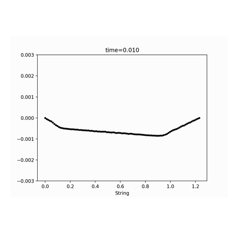

# NumericalVisuals
This repository serves as a collection of numerical implementations exploring some mathematical models, mostly consists of small 
course projects from *MATH-UH 3413 Numerical Methods* and *MATH-UA 264 Nonlinear Dynamics*. 
## 1. Turing Patterns 🪸(Gray-Scott Model)

An implementation of the reaction-diffusion system modelded by the Gray-Scott equations. This simulation illustrates the instability in chemical reaction system, where
a stable equilibrium is broken by diffusion, creating spots, coral like structures often seen in nature.\
The system solves for two chemical concentrations, $U$ and $V$, over a two-dimensional grid using the finite difference method:

$$
\begin{aligned}
\frac{\partial u}{\partial t} &= D_u \nabla^2 u - uv^2 + F(1 - u) \\
\frac{\partial v}{\partial t} &= D_v \nabla^2 v + uv^2 - (F + k)v
\end{aligned}
$$

- Relevant Algorithm: Forward Euler time integration 

 

## 2. Wave Propagation Simulator (Stiff String)

Mathematical models for wave propagation are typically entangled in complex, nonlinear derivatives. However, the stiff steel string presents an ideal linear case effectively described by Bensa (2003). This essay implements finite-difference schemes to solve this model, detailing the theoretical rationale, the numerical method, and an analysis of the outcomes.
The literature proposed the following family of partial differential equations:

$$
\begin{aligned}
\frac{\partial^2 y }{\partial t^2} &= c^2\frac{\partial^2 y }{\partial x^2} - \kappa^2 \frac{\partial^4 y }{\partial x^4} - 2 b_1 \frac{\partial y }{\partial t} + 2b_2 \frac{\partial^3 y }{\partial x^2 \partial t}
\end{aligned}
$$

- Relevant Algorithm: Finite Difference Method
- For theoretical background and modeling details, see:
 [📄 WavePropagationIntroduction.pdf](./WavePropagationIntroduction.pdf)
- References: Bensa, B. S. K.-M. R. . S. J. O. r., J. (2003). The simulation of piano string vibration: from physical models to finite difference schemes and digital waveguides. The Journal of the Acoustical Society of America, 114(2), 1095–1107. doi: 10.1121/1.1587146

 

## 3. Lorenz Attractor 🦋

An implementation of the Lorenz system that models atmospheric convection. This model serves as an example of deterministic chaos, where small differences in initial conditions yield
widely diverging outcomes. The simulation presented here visualizes the trajectoryof a point tracing a strange attractor in three-dimensional space.\
The system describes the evolution of three variables, $(x, y, z)$, over time with:

$$
\begin{aligned}
\frac{\partial x}{\partial t} &= \sigma (y-x) \\
\frac{\partial y}{\partial t} &= x(\rho - z) - y \\
\frac{\partial z}{\partial t} &= xy-\beta z 
\end{aligned}
$$

- Relevant Algorithm: Forward Euler time integration
- Edge of Chaos: Instead of using a standard constant, the simulation calculates the theoretical Hopf Bifurcation limit ($\rho_H$) and sets the system just barely beyond it ($\rho = \rho_H + \epsilon$), capturing the precise mathematical threshold where stability collapses into the chaotic orbit.

 
